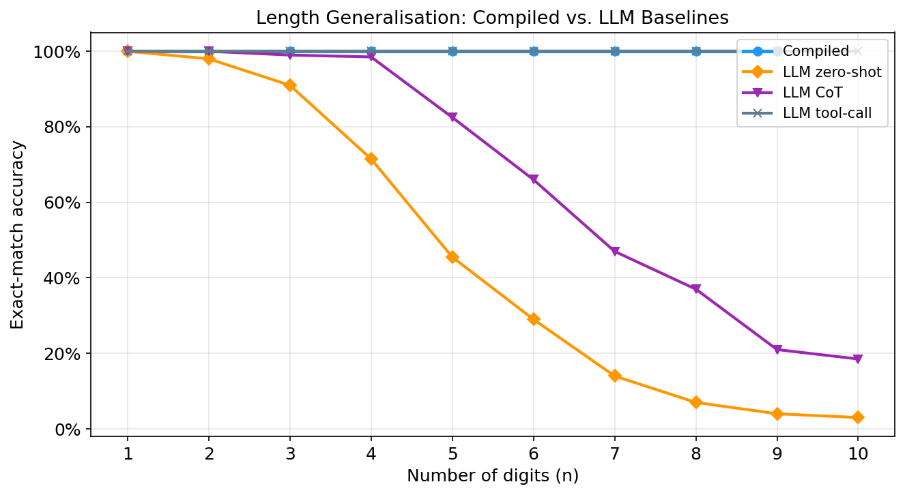

# Compiled Arithmetic in Transformers

**Provable Length Generalization for Addition**

A minimal 1-layer transformer with hand-compiled weights that performs exact n-digit addition for any n to something no standard LLM achieves without external tools.



## Key Results

| Model | n=1 | n=3 | n=5 | n=7 | n=9 |
|---|---|---|---|---|---|
| **Compiled (ours)** | 100% | 100% | 100% | 100% | 100% |
| LLM zero-shot | 100% | 91% | 46% | 14% | 4% |
| LLM chain-of-thought | 100% | 99% | 83% | 47% | 21% |
| LLM tool-calling | 100% | 100% | 100% | 100% | 100% |

Even tool-calling is 100% accurate, the tool-calling is not cost effective.
The compiled model is the only **neural forward-pass** solution achieving 100% accuracy at all digit lengths.

## Architecture

```
d_model = 36    n_heads = 3    MLP hidden = 200    layers = 1
Total parameters: 21,476 (all frozen, hand-compiled)
```

- **Head 0** : attends to the a-digit at the current step
- **Head 1** : attends to the b-digit at the current step
- **Head 2** : attends to the previous output token (carry propagation via shifted-key trick)
- **MLP** : 200-neuron lookup table, one ReLU neuron per (a, b, carry_in) triple

## How It Works

Addition is a 2-state FSM: `(a_i, b_i, carry_in) → (digit_out, carry_out)` with 10×10×2 = 200 transitions. The compiled transformer implements this exactly:

1. **Embedding** encodes carry in the token ID (tokens 0-9 = carry 0, tokens 10-19 = carry 1)
2. **Attention** routes the correct a-digit, b-digit, and previous carry to each output position
3. **MLP** maps each (a, b, carry) triple to the correct output digit and carry
4. **Causal decoding** processes digits LSB-first, propagating carry sequentially

## Project Structure

```
├── src/
│   ├── compiled/          # Core compiled model
│   │   ├── model.py       # Full compiled transformer (21,476 params)
│   │   ├── vocab.py       # Token vocabulary and encoding
│   │   └── dataset.py     # Addition dataset generator
│   ├── analysis/          # Mechanistic analysis
│   │   ├── probing.py     # Linear probes for carry state
│   │   ├── attention_viz.py
│   │   └── adversarial.py # Carry-chain stress tests
│   └── eval/              # Evaluation
│       ├── metrics.py     # Accuracy metrics
│       └── run_baselines.py
├── experiments/           # Experiment scripts
├── results/               # JSON results + figures
├── docs/                  # GitHub Pages site
├── paper/                 # LaTeX paper
└── visualize.py           # Generate all figures
```

## Quick Start

```bash
# Run all experiments
python -m experiments.run_all

# Generate figures
python visualize.py

# Run individual phases
python -m experiments.phase1_compiled
python -m experiments.phase3_llm
python -m experiments.phase4_mechanistic
```

## Mechanistic Analysis

- **Attention maps** : All 3 heads show sharp, near-diagonal patterns confirming exact routing
- **Carry probes** : Logistic regression on residual activations decodes carry with 99.3-100% accuracy
- **Adversarial carry chains** : 999...9 + 1 = 1000...0 passes for all tested lengths

## References

- Power et al. 2022 : Grokking: Generalization beyond overfitting
- Nanda et al. 2023 : Progress measures for grokking via mechanistic interpretability
- Giannou et al. 2023 : Looped Transformers as Programmable Computers
- Weiss et al. 2021 : Thinking Like Transformers
- Anil et al. 2022 : Exploring length generalization in large language models
- Lee et al. 2023 : Teaching arithmetic to small transformers

## Contribute
Contribute the work pls.
